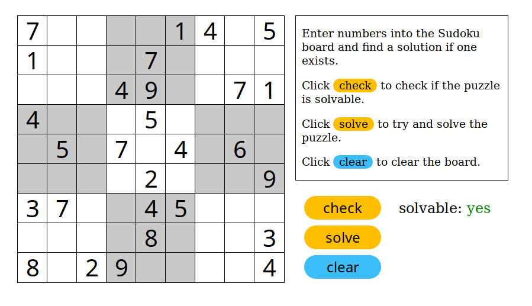

# SudokuSolverGUI
A basic JavaScript Sudoku solver with an HTML gui.

[Use it on GitHub Pages.](https://jeremy119watson.github.io/SudokuSolverGUI/)

---
Just did this for fun.

And by writting code to solve it, technically I solved the puzzle.
